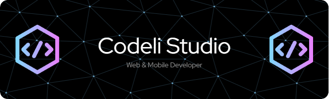

Hi 👋 My name is Juan Correa
============================

Software Developer

------------------------

* 🌍  I'm based in Mexico
* 🖥️  See my portfolio at [codeli web page](http://codeli-studio.com)
* ✉️  You can contact me at [jose-juan.correa@outlook.com](mailto:jose-juan.correa@outlook.com)
* 🧠  I'm learning AWS
* 🤝  I'm open to collaborating on Web (Typescript), ASP.NET (C#) and Mobile (Kotlin) projects

### Skills

